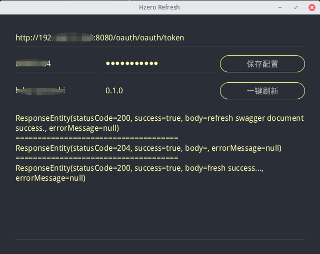

# Hzero一键刷新

在Hzero框架下做开发，经常会因为修改一个接口就要去手动调接口刷新swagger、config、iam等服务。每次都在swagger页面上去刷新还是挺麻烦的，因此做了这个一键刷新.jar。

**note**: only supports JDK8

## package
- jar
```shell script
cd hzero-refresh
mvn package -DskipTests=true
# can also use:  mvn jfx:jar 
```
- native
deb,exe,rpm or binary
```shell script
cd hzero-refresh
mvn jfx:native -DskipTests=true
```
## run
```shell script
java -jar target/HzeroOneKeyRefresh-jar-with-dependencies.jar
```

## screenshot

